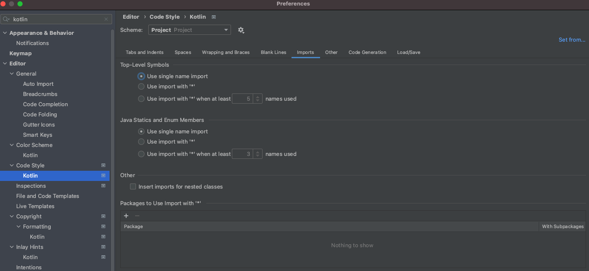
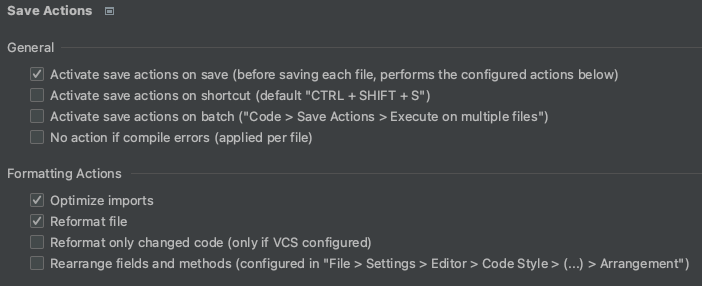
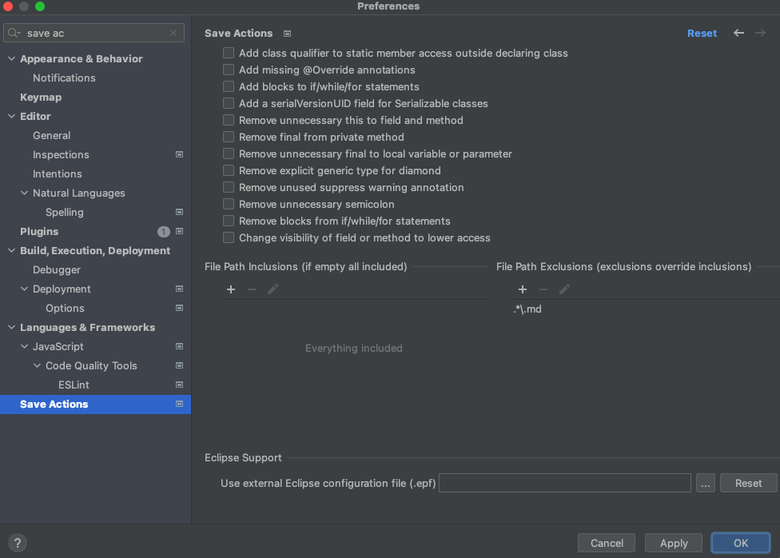

# Common Code Formatting for Kotlin

To ensure that all Kotlin files in a commit conform to
the [Kotlin Style Guide](https://developer.android.com/kotlin/style-guide), the code formatter **Ktlint** is used in the
project. This code formatter is integrated in the build pipeline via
the [Spotless plugin](https://github.com/diffplug/spotless/tree/main/plugin-gradle). <br>
So, the local build of the project as well as the build pipeline will fail if a Kotlin file is not formatted
properly. <br>

If the local build fails, you have the opportunity to auto format all files with a format violation with the following
command:

```shell
./gradlew spotlessApply
```

**Hint**: It is possible that *spotlessApply* can't fix all violations in your commit. E.g, if you have a wildcard
import, *spotlessApply* won't be able to correct the imports by itself. In this case, you will receive an error message
with the Kotlin file that has a format violation. <br>
Also, the execution of

```shell
./gradlew build
```

fails and shows you the error message with the format violation. <br>

To avoid failing builds, the formatting config of your IDE should be set properly. The recommended preferences are
described in the following.

## IDE Formatting Configuration

### IntelliJ

As described in the Kotlin Style Guide, wildcard imports should be avoided. To configure this in IntelliJ, you have to
navigate in the **Preferences** to:  <br>
**Editor** > **Code Style** > **Kotlin** <br>
Make sure that you choose the option **"Use single name import"**
for the sections **Top-Level Symbols** and **Java Statics and Enum Members**. <br>
Also, you should remove all values from the section **Packages to Use Import with "&#42;"**
so that this table is empty, as shown in the screenshot below:



<br>
Furthermore, you have to install the Plugin "Save Actions". After the installation, tick the following
options: 

- **Activate save actions on save (before saving each file, performs the configured actions below)**
- **Optimize imports**
- **Reformat file**



To avoid unwanted reformattings of markdown files, you should exclude these files by the following path:

```shell
.*\.md
```

Add this path to the section *File Path Exclusions* as shown below:


